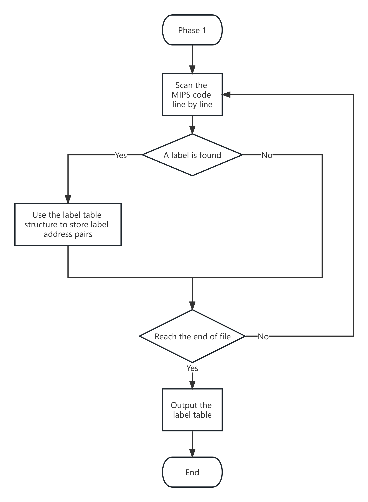
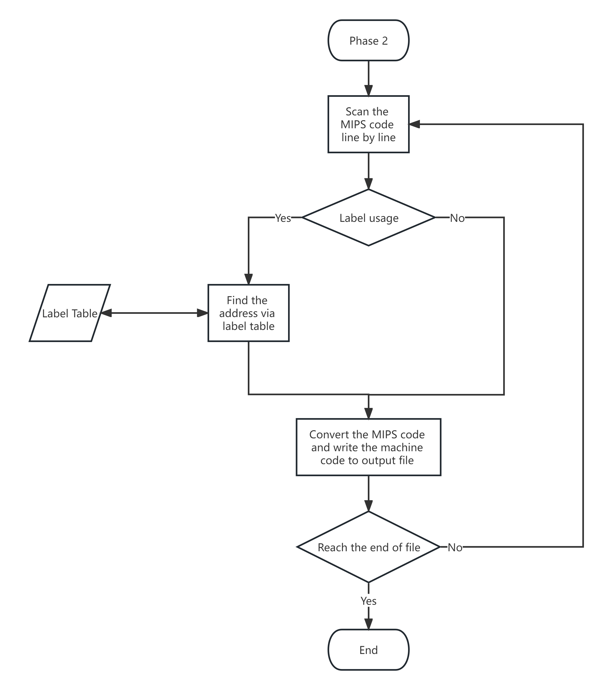

## CSC3050 Assignment 1

**121020163 沈驰皓**

### 1. Overview of How Assembler Works

In this assignment, we build an MIPS assembler, which takes an asm file containing a type of assembly language called MIPS code as an input, and outputs a file containing the corresponding machine code. Basically, the MIPS code contains three big types of instructions, R, J and I. For each type, the assembler needs to translate the corresponding part of the instruction into a finite number of binary numbers, and combine them into a line of 32-bit machine code differently. Each line of the instruction corresponds to a line of machine code. Thus, the assembler reads the MIPS code line by line and gives the output for each line in sequence. If the assembler meets with a label, it needs to handle the label by fetching the correct absolute address or relative address of that label. Finally, the assembler outputs a file containing all the machine code.

### 2. High Level Implementation Ideas

I use Python to implement the assembler. Due to the existence of the labels, I breakdown the problem into two subproblems. The first subproblem is to deal with the label address problem, and the second is to process the code conversion part. Thus, in order to solve the problem, I implement two phases and a label table structure to contain the label information. For the phase 1 part, the assembler scans the input file for the first time in order to get all the labels and their address in the input file. After that, it stores all these label-address pairs in that label table data structure. The reason to do this is to help the assembler fetch the label address much more conveniently while it's encountering some labels during the second reading time. Then for the phase 2 part, the assembler scans the input file again. This time, it reads each instruction line separately and converts it into the corresponding binary machine code line by line. If a label is met, it can now directly fetch the label address from the label table, and then convert it into the relative address or absolute address for which the instruction is required. Finally, as explained above, it outputs a text file containing all the machine code.

### 3. Implementation Details

#### A. Label Table Structure

The label table structure is implemented in the file **labelTable.py**. Here we create a class called `LabelSet`. It contains a property called `labels`, which is a dictionary in order to store all label-address pairs. We implement three methods for this class. The method `get_address(label)` is used to get the absolute address of a given label. The method `set_label(label, address)` is used to store the address of the corresponding label in the property `label` of the class. And the method `get_labels` is used to get all the label names in the property `label` of the class.

#### B. Phase 1

Here is the work flow in phase 1:

    
     
    
Figure 1: Phase 1 work flow

The phase 1 part is written in **phase1.py**. At the very beginning of phase 1, we use `file.seek()` to save the location of the end of the file in the variable `eof` for further use. We also create a variable `address` to record the current address. It is set to be the start address at the beginning of the file, which is 0x400000. Then we try to find the ".text" note, which denotes the start of the MIPS code. After that, we just simply read the content after ".text" line by line and search for labels. Whenever an instruction is encountered, we add the current address to 4, since each instruction occupies a word. To find a label, we try to find the ":" symbol. Whenever encounter a ":", we obtain the part before the ":" symbol to be the name of the label, and we can simply get the current address by reading the variable `address`. To store the label information, we create a variable called `label_address`, which is a `LabelSet` class implemented above. Then we use the method `set_label(label, address)` of the class to store the label and its address. Finally, we compare the current position of the file to `eof` to tell whether we reach the end of the input file. If we reach this, then the phase 1 is done.

Note that while reading the line, if the "#" symbol exists, we need to use `line = line.split("#")[0]` function to eliminate the comment part.

#### C. Phase 2

Here is the work flow in phase 2:

    
     
    
Figure 2: Phase 2 work flow

The phase 2 part is written in **phase2.py**. 

In phase 2, for the sake of convenience, I first create several constant variables. The first I create is called `REGS`, which is a list containing all register names, and the index of any register is the corresponding code, which can then be directly changed to a 5-bit binary code for usage. Then I create several dictionaries containing all instructions. For instance, `INST_R` contains all R instructions. The key is the instruction name, while the value is a list including all requisite parts. The first content of the list is the opcode, the second is the function code, and the third is a list containing all the rest field names that the user needs to input. `INST_I`, `INST_J` are similar, instead that `INST_I` does not have a function code part, and all the field needed is only "label" for `INST_J`.

Then I define three classes: `RType`, `IType` and `JType`. All three types contain a property of opcode which should be initialized during variable creation (For R instruction, a function code property is also required and should be initialized). They also contain a property called `fields` for the rest field code, while that of the J instruction is called `target`, since it only needs a target address for jumping. Each class has a standard `set_field(field)` method for input, the field of which is a tuple containing the field name and its code (`set_label(target)` for J instruction, whose target is a string which is a 26-bit binary target code), and a standard `print_code()` method for output. Therefore, by using these classes, all the instructions could be structurized nicely and easily.

Then we come to the phase 2 scanning part. In order to get usage of the label table, we import it from phase 1. Like phase 1, we first find the ".text" note, remove the comment and label part, and then scan the content. Whenever an instruction is met, we split the line, fetch the instruction name, determine which instruction it is, and then create the variable using the corresponding class. After that, we can then use `set_field(field)`/`set_label(target)` method to set the field code. For a register, we obtain the index number in `REGS` as its field code. For a label, we fetch the address from the label table that we have imported. At last, we use the standard `print_code()` method to return the 32-bit binary machine code and write it in the output file. Same as in phase 1, we compare the current position to `eof` to tell whether we reach the end. If we reach this, then the phase 2 is also done. The code in the output is finished and all work is done.

