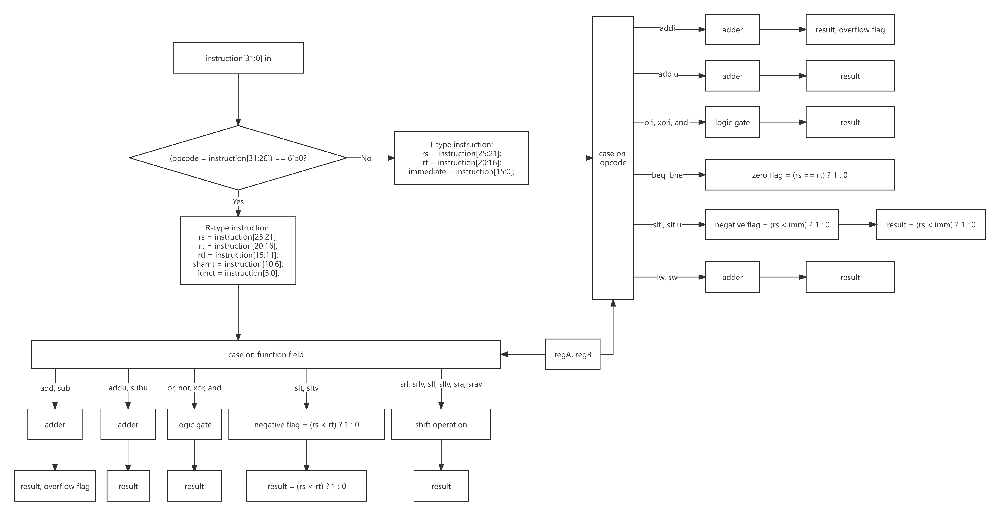

## CSC3050 Assignment 3

**121020163 沈驰皓**

### 1. Overview of ALU functionality

Basically, ALU (Arithmetic Logic Unit) is a combinational logic unit in which the CPU performs some computation operations. 

After the instruction is sent to the CPU, the control part will then trim and parse the specific part with respect to the type of instruction and send corresponding signals. Then the datapath will do the data flow and processing part. 

During the processing, the ALU plays a very important role in it. It will receive two 32-bit binary numbers and an ALU opcode as input. Then it will do a specific logic, arithmetic or comparing operation to those two numbers according to the ALU opcode which is given by the instruction. Finally, it will output the 32-bit binary result, as well as some flags. Here we only take zero, negative and overflow flags into consideration.

### 2. Data Flow Chart

<center>
    
    <br>
    <div style="color:orange; border-bottom: 1px solid #d9d9d9;
    display: inline-block;
    color: #999;
    padding: 2px;">Figure 1: Data Flow Chart</div>
</center>

### 3. High Level Implementation Ideas

We write our CPU implementation in `alu.v` and write the test bench in `test_alu.v`. Here we only implement the operations shown on the chart. Given the input of the instruction and the binary input of 32-bit `regA` and `regB`, we break the problem into three parts. Firstly, we check the opcode part to determine whether the instruction is R-type or I-type and do the instruction segmentation. Secondly, we use the `rs` and `rt` values parsed from the first step to fetch the register values. If the register is `5'b0`, we fetch the value from `regA`, otherwise we fetch the value from `regB`. Finally, we do the instruction implementation part. We use case on opcode and function code together to decide which instruction I should use and implement them in detail. For add, addi and sub, we need to consider the overflow flag, for beq and bne, we need to consider the zero flag, and for slt, slti, sltu and sltiu, we need to consider the negative flag.

### 4. Implementation Details

##### a.  code parsing and register value parsing

Here we implement a wire vector `opcode`, several reg vectors `funct`, `rs`, `rt`, `rd`, `shamt` and `immediate`. Since `opcode` is fixed, we set it as a wire type and directly parse [31:26] of the instruction to it. If the instruction is R-type, we parse [25:21] to `rs`, [20:16] to `rt`, [15:11] to `rd`, [10:6] to `shamt` and [5:0] to `funct`. If it is I-type, we parse [25:21] to `rs`, [20:16] to `rt` and [15:0] to `immediate`.

Since the input of all instructions corresponds to only rt and rs registers, therefore, we also implement two reg vectors `rs_reg` and `rt_reg` to store the input value, which is given by the input `regA` and `regB` as mentioned above.

##### b.  instruction implementation

As is said above, we use opcode and function code together to decide the instruction. Therefore, we use a nested case function on both opcode and function code to determine the instruction, which is shown below:

```verilog
case (opcode)
            // R-type
            6'h00: begin
                case (funct)
                    6'h20: ......
                    6'h21: ......
                    ......
                endcase
            end
    
            // I-type
            6'h08: ......
            ......
endcase
```

Note that for sll, sllv, srl, srlv, we directly add zeros to either side of the binary number and eliminate the same number of bits on the other side. But for sra and srav, we need to decide on the most significant bit and extend this bit to the left-hand side. Therefore, we need to first give a sign to the register vector, and then do the arithmetic shift, since verilog treats numbers to be unsigned by default. The Implementation should be `result = $signed(rt_reg) >>> shamt` for sra (srav is similar). Also note that for set on less than type, all four instructions have a result of 1 if `rs_reg < rt_reg/immediate` and 0 if `rs_reg >= rt_reg/immediate`, comparing to beq and bne whose result doesn't matter. For other instructions, the detailed content would not be shown here.

##### c. sign and zero extension for immediate

In I-type instructions, for logic immediate operations andi, ori and xori, we use zero extension. For all other immediate operations, we all use sign extension, which extends the immediate with the most significant bit. For zero extension, we use `{16'b0, immediate}` to represent the zero-extended number. For sign extension, we create a reg vector named `temp_reg` and use `$signed()` function `temp_reg = $signed(immediate)`.

##### d. flags

We create a 3-bit reg vector named `flags` to store those flags, in which `flags[0]` is the overflow flag, `flags[1]` is the negative flag, and `flags[2]` is the zero flag.

###### (1) overflow flag

For the overflow flag, we only need to consider add, addi and sub. Therefore, after calculation, we only need to compare the most significant bit of both operands and the result to detect whether the overflow occurs. For add, we have the following two cases: (addi is similar)

```verilog
if ({result[31], rs_reg[31], rt_reg[31]} == {3'b011} || {result[31], rs_reg[31], rt_reg[31]} == {3'b100})
	flags[0] = 1'b1;
```

And for sub, we also have the following two cases:

```verilog
if ({result[31], rs_reg[31], rt_reg[31]} == {3'b101} || {result[31], rs_reg[31], rt_reg[31]} == {3'b010})
	flags[0] = 1;
```

###### (2) zero flag

For the zero flag, we should consider beq and bne. If both two operands are the same, then the flag is set to 1, else 0.

###### (3) negative flag

For the negative flag, we need to deal with slt, slti, sltiu and sltu. For slt and slti, since the operands are signed numbers, we need to discuss the following cases for slt in case of overflow: (slti is similar)

```verilog
if (rs_reg[31] == 1 && rt_reg[31] == 0) begin
	flags[1] = 1'b1;
	result = 32'b1;
end
else if (rs_reg[31] == 0 && rt_reg[31] == 1) begin
	flags[1] = 1'b0;
	result = 32'b0;
end
else if ($signed(rs_reg - rt_reg) < 0) begin
	flags[1] = 1'b1;
	result = 32'b1;
end
else begin
	flags[1] = 1'b0;
	result = 32'b0;
end
```

But for sltu and sltiu, since both operands are unsigned numbers, we can directly do the comparison.

###### e. test bench

For test cases, we just manually write inputs to each instruction, including normal and overflow / flag = 1 types for some instructions with one of the three flags. A `#1` interval is set between any neighboring test cases in order to record the results.